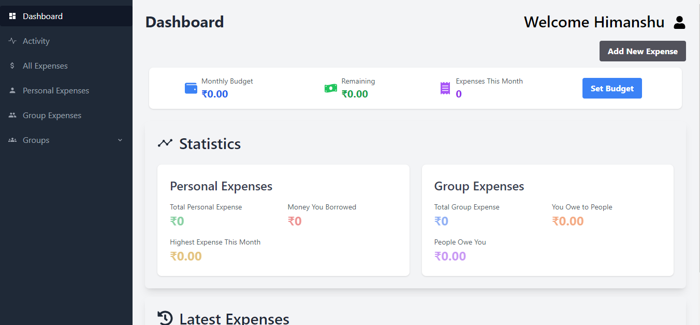

# TrackEx - Personal and Group Expense Tracke
TrackEx is a comprehensive expense tracking application that allows users to manage both personal and group expenses effortlessly. With an intuitive interface and powerful features, TrackEx helps you stay on top of your finances and easily split costs with friends, roommates, or travel buddies.
 
Check Out : https://trackex-sigma.vercel.app/

## Features

### 1. Dashboard Overview
- At-a-glance view of personal and group expenses
- Monthly budget tracker with remaining balance and expenses this month
- Quick access to add new expenses

### 2. Personal Expense Management
- Track individual expenses with detailed categorization
- View total personal expenses, money borrowed, and highest expense of the month
- Easily navigate to a comprehensive list of all personal expenses

### 3. Group Expense Tracking
- Create and manage multiple groups for shared expenses
- Track total group expenses, amounts owed to others, and amounts others owe you
- Detailed breakdown of balances within each group

### 4. Expense Splitting
- Automatically calculate and split expenses among group members
- View who owes what and to whom within each group
- Simplify the repayment process for a stress-free group financial experience

### 5. Budget Setting and Tracking
- Set monthly budgets for better financial planning
- Real-time tracking of expenses against the set budget
- Visual representation of budget utilization

### 6. Activity Log
- Keep track of all financial activities in one place
- View recent personal and group expenses

### 7. Detailed Expense Views
- Separate sections for all expenses, personal expenses, and group expenses
- Tabular view with sorting and filtering options

### 8. User-friendly Interface
- Clean and intuitive design for easy navigation
- Responsive layout that works well on both desktop and mobile devices

### 9. Security and Privacy
- Secure user authentication system
- Private expense information, visible only to authorized group members

## Installation and Setup

1. Clone the repository:
git clone https://github.com/yourusername/trackex.git
Copy2. Navigate to the project directory:
cd trackex
Copy3. Install dependencies:
npm install
Copy4. Start the development server:
npm start
Copy5. Open your browser and visit `http://localhost:3000`

## Technologies Used

- React.js
- React Router for navigation
- Context API for state management
- Tailwind CSS for styling

## Contributing

Contributions to TrackEx are welcome! Here's how you can contribute:

1. Fork the repository
2. Create a new branch (`git checkout -b feature/AmazingFeature`)
3. Commit your changes (`git commit -m 'Add some AmazingFeature'`)
4. Push to the branch (`git push origin feature/AmazingFeature`)
5. Open a Pull Request

Please make sure to update tests as appropriate and adhere to the existing coding style.

## Contact

Himanshu Sharma - sharmahimanshu6478@gmail.com

Project Link:https://github.com/himanshusharma2007/Expense-Tracking-App.git